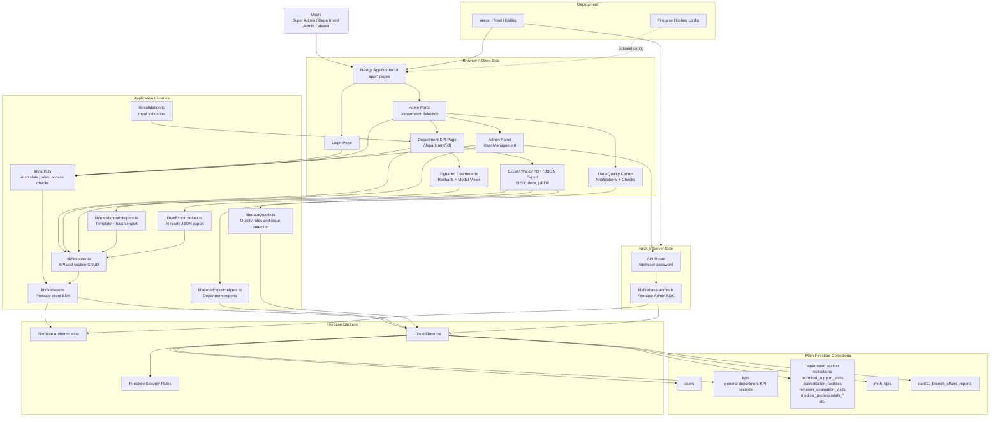

# Architecture Diagram - GAHAR KPI Application

هذا الرسم يوضح المعمارية العامة لتطبيق إدارة مؤشرات الأداء، بناء على هيكل المشروع الحالي.

## High-Level Flow

1. المستخدم يسجل الدخول من `/login` عبر Firebase Authentication.
2. `lib/auth.ts` يجلب ملف المستخدم من مجموعة `users` في Firestore ويحدد الدور والصلاحيات.
3. الصفحة الرئيسية تعرض الإدارات المتاحة حسب الدور.
4. صفحة `/department/[id]` تعرض نموذج إدخال المؤشرات، الجداول، الاستيراد، التصدير، ولوحات التحليل.
5. `lib/firestore.ts` يمثل طبقة الوصول الأساسية لبيانات المؤشرات ومجموعات الأقسام.
6. التقارير والتصدير تتم غالبا من جهة المتصفح باستخدام `xlsx`, `docx`, `jspdf` وبيانات Firestore.
7. العمليات ذات الصلاحيات العالية، مثل إعادة تعيين كلمة المرور، تمر عبر Next.js API route وتستخدم Firebase Admin SDK.

## Main Architectural Layers

- Presentation Layer: صفحات Next.js ومكونات React داخل `app/` و `components/`.
- Auth and Authorization Layer: `lib/auth.ts` مع Firebase Auth وأدوار المستخدمين.
- Data Access Layer: `lib/firestore.ts` و Firebase Client SDK.
- Reporting and Import Layer: `lib/excelImportHelpers.ts`, `lib/excelExportHelpers.ts`, `lib/aiExportHelper.ts`.
- Server Admin Layer: `app/api/reset-password/route.ts` و `lib/firebase-admin.ts`.
- Backend Services: Firebase Authentication و Cloud Firestore.
