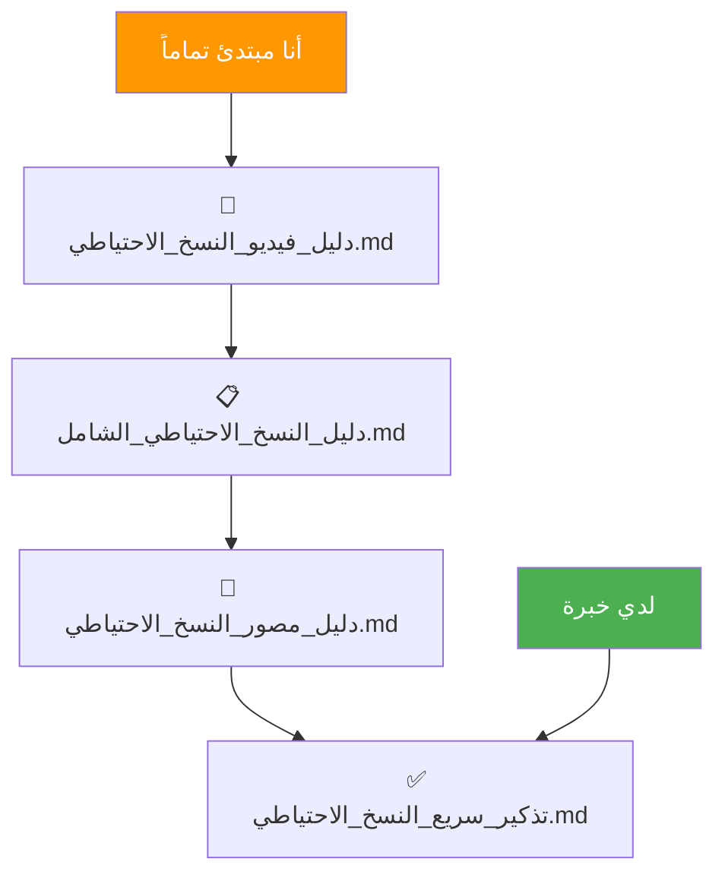

# 📚 مركز أدلة النسخ الاحتياطي والاستعادة

## مرحباً بك! 👋

هذا المجلد يحتوي على كل ما تحتاجه لحماية تطبيقك. اختر الدليل المناسب لك:

---

## 🎯 ابدأ من هنا (للمبتدئين)

### أي دليل أقرأ أولاً؟



---

## 📖 الأدلة المتاحة

### 1️⃣ [دليل_النسخ_الاحتياطي_الشامل.md](./دليل_النسخ_الاحتياطي_الشامل.md) 📚
**لمن؟** المبتدئين الذين يريدون شرح تفصيلي كامل

**ماذا يحتوي؟**
- ✅ شرح مفصل لكل خطوة
- ✅ 3 سيناريوهات للاستعادة
- ✅ استكشاف الأخطاء وحلولها
- ✅ نصائح مهمة للأمان
- ✅ قوائم تحقق

**الوقت المتوقع للقراءة:** 20-30 دقيقة

**⭐ ابدأ من هنا إذا كنت تقرأ لأول مرة!**

---

### 2️⃣ [دليل_فيديو_النسخ_الاحتياطي.md](./دليل_فيديو_النسخ_الاحتياطي.md) 🎥
**لمن؟** الذين يفضلون الشرح بأسلوب المحادثة

**ماذا يحتوي؟**
- ✅ شرح على شكل "فيديوهات" نصية
- ✅ تشبيهات بسيطة جداً
- ✅ حوار ودي وواضح
- ✅ أسئلة وأجوبة شائعة

**الوقت المتوقع للقراءة:** 30 دقيقة

**⭐ مثالي للمبتدئين الكاملين!**

---

### 3️⃣ [دليل_مصور_النسخ_الاحتياطي.md](./دليل_مصور_النسخ_الاحتياطي.md) 🎨
**لمن؟** الذين يفضلون التعلم بصرياً

**ماذا يحتوي؟**
- ✅ رسوم توضيحية Mermaid
- ✅ مخططات انسيابية
- ✅ جداول مقارنة
- ✅ خرائط ذهنية

**الوقت المتوقع للقراءة:** 15 دقيقة

**⭐ رائع للمراجعة والفهم السريع!**

---

### 4️⃣ [تذكير_سريع_النسخ_الاحتياطي.md](./تذكير_سريع_النسخ_الاحتياطي.md) ⚡
**لمن؟** من يريد مرجع سريع

**ماذا يحتوي؟**
- ✅ الأوامر الأساسية فقط
- ✅ خطوات مختصرة
- ✅ جدول الأوامر المهمة

**الوقت المتوقع للقراءة:** 2-3 دقائق

**⭐ للمراجعة السريعة بعد أن تتعلم الأساسيات!**

---

### 5️⃣ [قائمة_التحقق_النسخ_الاحتياطي.md](./قائمة_التحقق_النسخ_الاحتياطي.md) ✅
**لمن؟** للطباعة والاحتفاظ بجانب الجهاز

**ماذا يحتوي؟**
- ✅ قوائم تحقق قابلة للطباعة
- ✅ جدول لتسجيل النسخ
- ✅ معلومات الطوارئ

**⭐ اطبعه واحتفظ به!**

---

## 🚀 البدء السريع (في 5 دقائق)

### للنسخ الاحتياطي الآن:

**الطريقة السريعة:**
1. انقر مرتين على ملف [`نسخة_احتياطية_تلقائية.bat`](./نسخة_احتياطية_تلقائية.bat)
2. انتظر حتى ترى "All done!"
3. انسخ مجلد التطبيق يدوياً لهارد خارجي

**الطريقة اليدوية:**
```powershell
# في Terminal:
cd d:\تطبيقي
node backup-firestore.js
```

---

## 🆘 في حالة الطوارئ

### التطبيق لا يعمل؟

1. **لا تذعر! 😌**
2. افتح [`دليل_النسخ_الاحتياطي_الشامل.md`](./دليل_النسخ_الاحتياطي_الشامل.md)
3. اذهب إلى قسم "استعادة التطبيق"
4. اختر السيناريو المناسب:
   - **السيناريو 1:** مشكلة في الكود
   - **السيناريو 2:** مشكلة في البيانات  
   - **السيناريو 3:** انهيار كامل

---

## 📁 هيكل الملفات

```
d:\تطبيقي/
│
├── 📘 دليل_النسخ_الاحتياطي_الشامل.md       (الدليل الأساسي)
├── 🎥 دليل_فيديو_النسخ_الاحتياطي.md         (أسلوب محادثة)
├── 🎨 دليل_مصور_النسخ_الاحتياطي.md          (رسوم توضيحية)
├── ⚡ تذكير_سريع_النسخ_الاحتياطي.md         (مرجع سريع)
├── ✅ قائمة_التحقق_النسخ_الاحتياطي.md      (للطباعة)
├── 🤖 نسخة_احتياطية_تلقائية.bat            (سكريبت تلقائي)
├── 📄 backup-firestore.js                   (كود النسخ الاحتياطي)
├── 📄 restore-firestore.js                  (كود الاستعادة)
│
└── 📁 backups/
    ├── firestore-2025-12-12/
    ├── firestore-2025-12-11/
    └── ...
```

---

## 🎯 خارطة الطريق للمبتدئ

### اليوم الأول: التعلم
- [ ] اقرأ [`دليل_فيديو_النسخ_الاحتياطي.md`](./دليل_فيديو_النسخ_الاحتياطي.md) (30 دقيقة)
- [ ] اقرأ [`دليل_النسخ_الاحتياطي_الشامل.md`](./دليل_النسخ_الاحتياطي_الشامل.md) (20 دقيقة)
- [ ] جرّب عمل أول نسخة احتياطية (15 دقيقة)

### اليوم الثاني: التدريب
- [ ] جرّب استعادة نسخة احتياطية في مجلد اختبار (30 دقيقة)
- [ ] اطبع [`قائمة_التحقق_النسخ_الاحتياطي.md`](./قائمة_التحقق_النسخ_الاحتياطي.md)
- [ ] اعمل نسخة احتياطية على هارد خارجي

### اليوم الثالث: الروتين
- [ ] اجعل النسخ الاحتياطي عادة أسبوعية
- [ ] احفظ النسخ في 3 أماكن
- [ ] راجع [`تذكير_سريع_النسخ_الاحتياطي.md`](./تذكير_سريع_النسخ_الاحتياطي.md) عند الحاجة

---

## 💡 نصائح سريعة

| النصيحة | التفاصيل |
|---------|---------|
| 📅 **اجعلها عادة** | كل أحد، نسخة احتياطية |
| 💾 **3 أماكن** | جهازك + هارد + سحابة |
| ✅ **اختبر دائماً** | جرب الاستعادة كل 3 أشهر |
| 📝 **سجّل كل شيء** | اكتب تاريخ ومحتوى كل نسخة |
| 🔒 **احمِ ملف .env.local** | هذا الملف حساس جداً! |

---

## 🔗 روابط مفيدة

- [BACKUP-GUIDE.md](./BACKUP-GUIDE.md) - دليل إنجليزي قديم (للمرجعية)
- [Firebase Console](https://console.firebase.google.com) - إدارة قاعدة البيانات
- [Vercel Dashboard](https://vercel.com/dashboard) - إدارة النشر

---

## 📞 الدعم والمساعدة

**إذا واجهت مشكلة:**

1. **راجع قسم "استكشاف الأخطاء"** في [`دليل_النسخ_الاحتياطي_الشامل.md`](./دليل_النسخ_الاحتياطي_الشامل.md)
2. **تأكد من اتباع الخطوات بالضبط**
3. **اسأل المساعد AI** - أنا هنا دائماً!

**الأخطاء الشائعة:**
- ❌ نسيان `npm install` بعد استعادة الكود
- ❌ كتابة تاريخ خاطئ في أمر الاستعادة
- ❌ عدم الانتظار حتى انتهاء العملية

---

## 🌟 رسالة تشجيعية

> **لا تخف من عمل نسخة احتياطية!**
>
> هذه العملية بسيطة جداً، وستصبح أسهل مع التكرار.
> **النسخ الاحتياطي = راحة البال** 💙
>
> أي سؤال؟ لا تتردد!

---

## ✨ آخر تحديث

**التاريخ:** 2025-12-12  
**الإصدار:** 1.0  
**مُعد خصيصاً للمبتدئين** 🎓

---

**ابدأ الآن! ↓**

### [📖 اقرأ الدليل الشامل](./دليل_النسخ_الاحتياطي_الشامل.md)

---

*تم إنشاء هذا الدليل بحب وعناية لمساعدتك* ❤️
