# دليل مصور - النسخ الاحتياطي خطوة بخطوة 🖼️

## نظرة عامة على عملية النسخ الاحتياطي

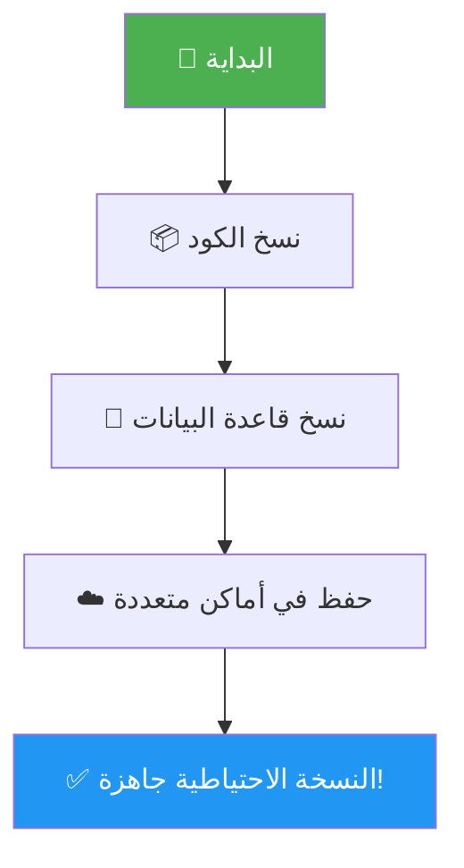

---

## المرحلة الأولى: نسخ الكود البرمجي

### الخطوة 1: فتح المجلد


**ما ستراه:**
- مجلد `app` 📁
- مجلد `components` 📁
- مجلد `lib` 📁
- ملف `.env.local` 📄
- ملف `package.json` 📄
- العديد من الملفات والمجلدات الأخرى

---

### الخطوة 2: إنشاء مجلد النسخ الاحتياطية

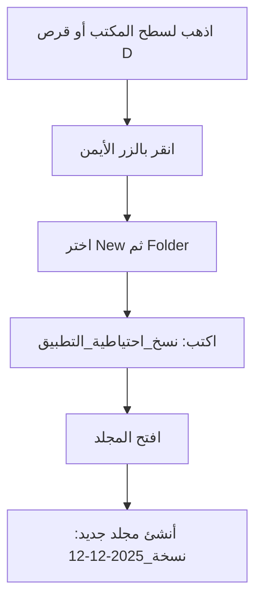

**النتيجة المتوقعة:**
```
📁 نسخ_احتياطية_التطبيق/
   └── 📁 نسخة_2025-12-12/
       └── (فارغ حالياً)
```

---

### الخطوة 3: نسخ الملفات

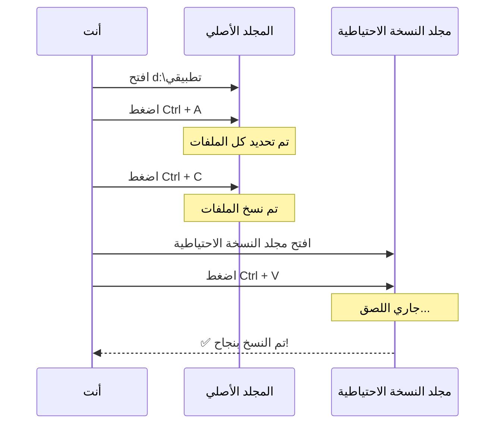

**مدة العملية:** 5-15 دقيقة (حسب حجم التطبيق)

---

## المرحلة الثانية: نسخ قاعدة البيانات

### العملية الكاملة

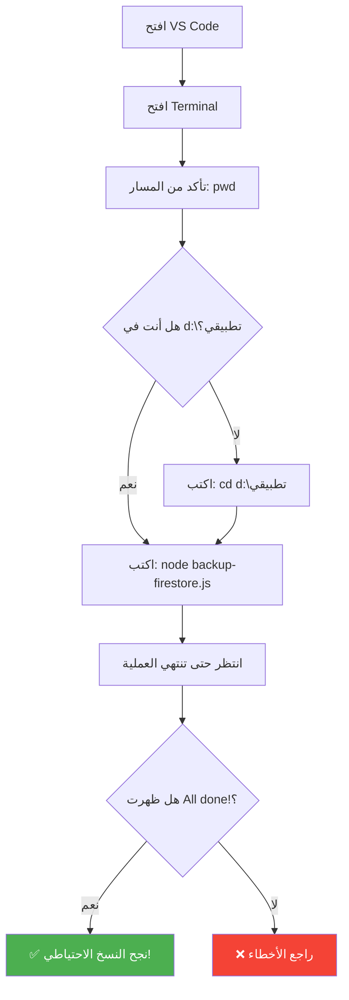

---

### ما يحدث داخل الأمر `node backup-firestore.js`

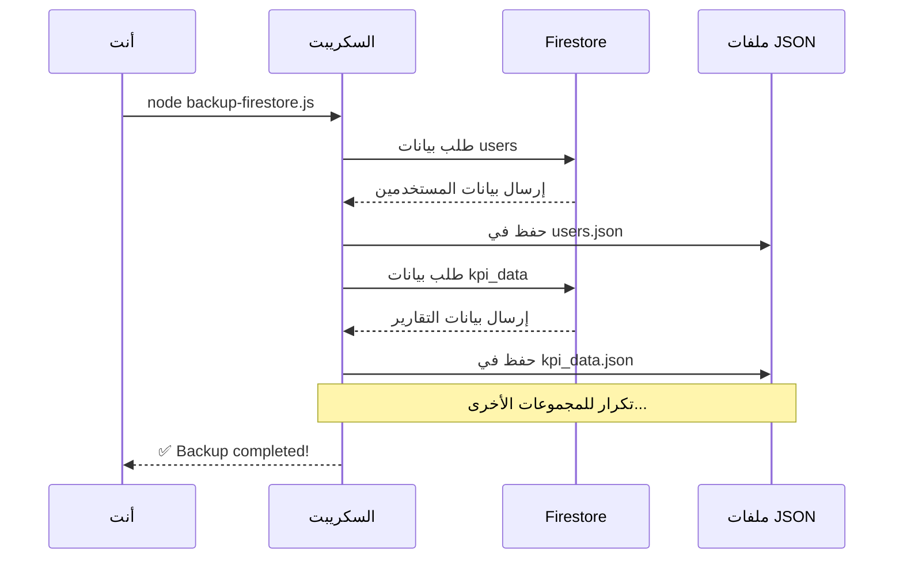

---

## المرحلة الثالثة: حفظ النسخ في أماكن متعددة

### قاعدة 3-2-1 المصورة

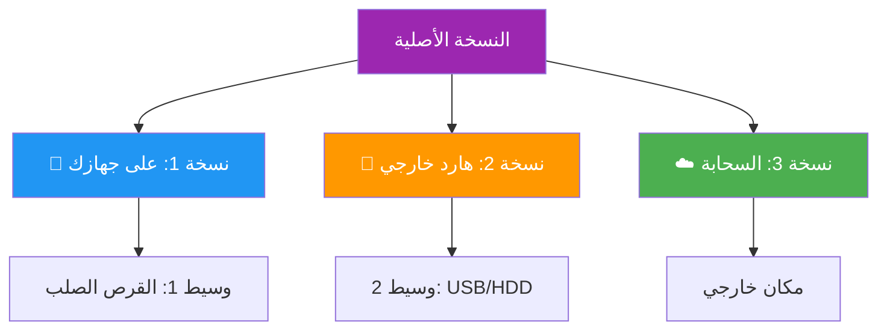

**التوزيع المثالي:**
- ✅ **نسخة على جهازك** → للوصول السريع
- ✅ **نسخة على هارد خارجي** → للحماية من عطل الجهاز
- ✅ **نسخة على السحابة** → للحماية من الكوارث الطبيعية

---

## عملية الاستعادة الكاملة

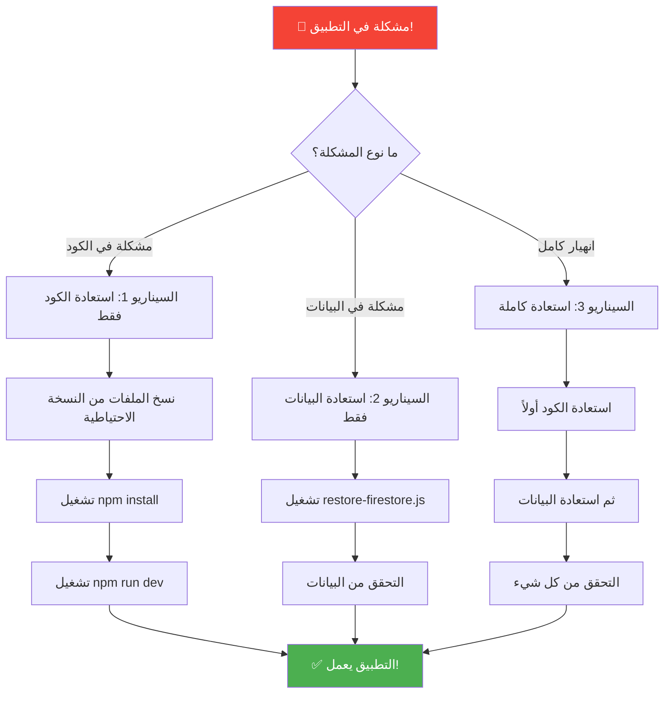

---

## استعادة الكود - خطوة بخطوة

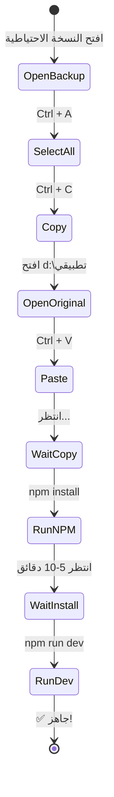

---

## استعادة قاعدة البيانات - خطوة بخطوة

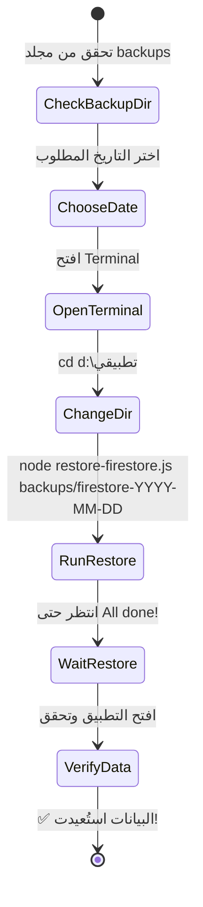

---

## جدول المقارنة: متى تستخدم أي سيناريو؟

| المشكلة | السيناريو المناسب | الوقت المتوقع | خطر فقدان البيانات |
|---------|-------------------|---------------|-------------------|
| ملف كود تالف | السيناريو 1 (استعادة الكود) | 15-20 دقيقة | ❌ لا يوجد |
| بيانات محذوفة خطأً | السيناريو 2 (استعادة البيانات) | 5-10 دقائق | ⚠️ بيانات بعد النسخة |
| التطبيق لا يعمل نهائياً | السيناريو 3 (استعادة كاملة) | 25-30 دقيقة | ⚠️ بيانات بعد النسخة |
| تحديث فاشل | السيناريو 1 أو 3 | 15-30 دقيقة | ⚠️ حسب الحالة |
| خطأ في قاعدة البيانات | السيناريو 2 | 5-10 دقائق | ⚠️ بيانات بعد النسخة |

---

## الخط الزمني: عمل نسخة احتياطية كاملة

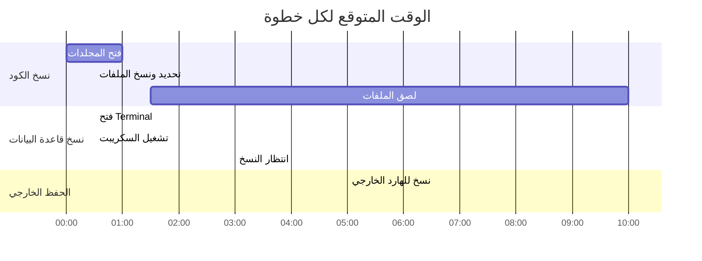

**المجموع الكلي:** حوالي 30 دقيقة

---

## شجرة الملفات المتوقعة بعد النسخ الاحتياطي

```
📁 نسخ_احتياطية_التطبيق/
│
├── 📁 نسخة_2025-12-12/
│   ├── 📁 app/
│   ├── 📁 components/
│   ├── 📁 lib/
│   ├── 📁 node_modules/
│   ├── 📁 backups/
│   │   └── 📁 firestore-2025-12-12/
│   │       ├── 📄 users.json
│   │       ├── 📄 kpi_data.json
│   │       ├── 📄 moh_kpis.json
│   │       └── 📄 ...
│   ├── 📄 .env.local
│   ├── 📄 package.json
│   └── 📄 ...
│
├── 📁 نسخة_2025-12-05/
│   └── ...
│
└── 📁 نسخة_2025-11-28/
    └── ...
```

---

## الأخطاء الشائعة وحلولها

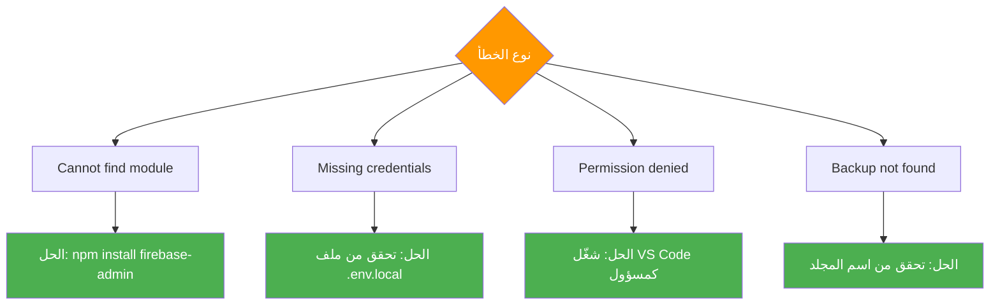

---

## نصائح الأمان

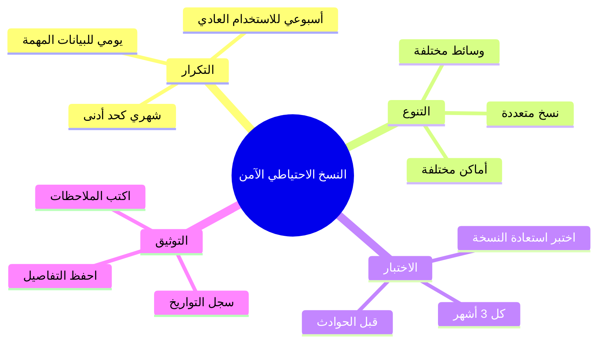

---

## ملخص سريع مصور


---

## قائمة تحقق بصرية

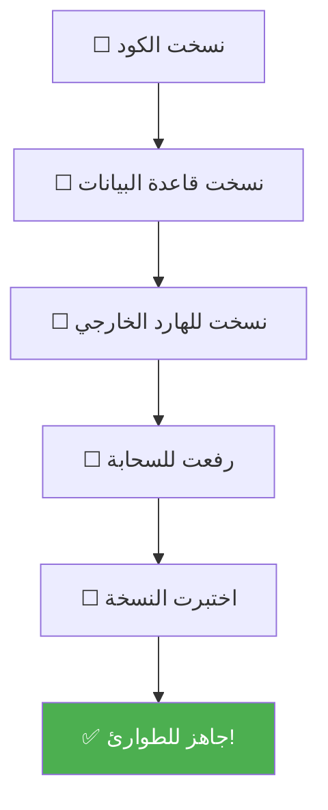

---

> [!NOTE]
> هذا الدليل المصور يكمّل الدليل النصي الشامل. استخدمهما معاً لفهم أفضل!

---

*آخر تحديث: 2025-12-12*
*الرسوم التوضيحية تُعرض تلقائياً في VS Code* 🎨
